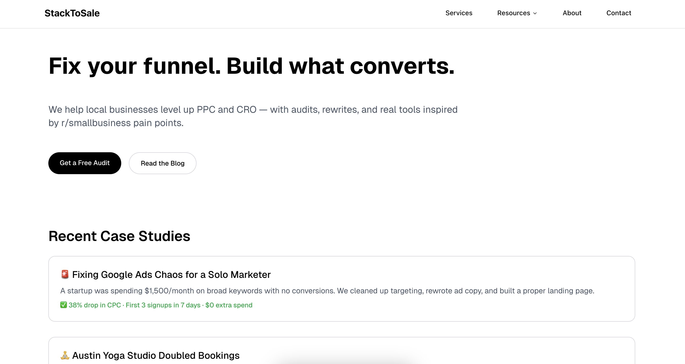
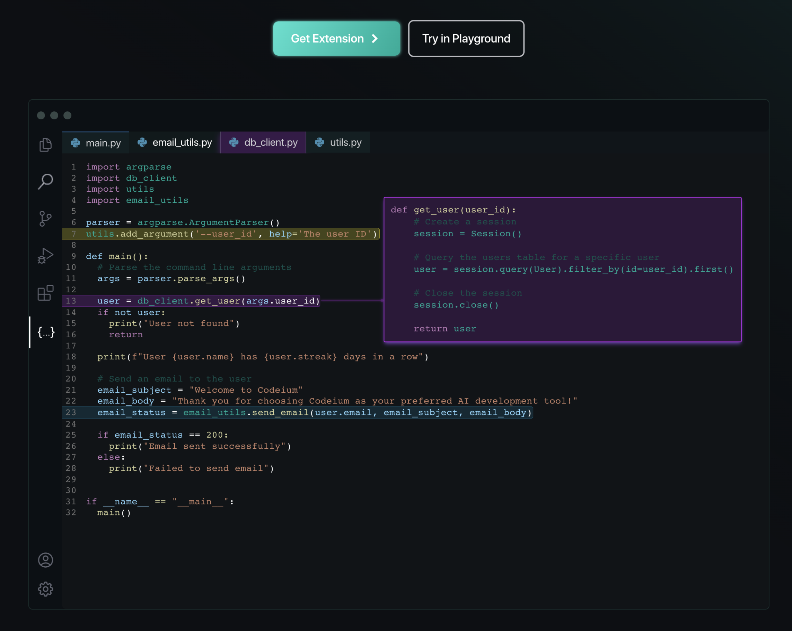

# brag-doc

📝 Snapshot of recent work — public-safe, non-sensitive.  
I document my work to improve, reflect, and stay accountable.

---

## 🚀 StackToSale (Oct 2024 – Present)  
**Role:** Founder / Technical Lead  
**Stack:** Next.js 14, WordPress, Tailwind, Firebase, Vercel  
**Highlights:**  
- Helped small businesses improve funnels through CRO and PPC tooling  
- Built marketing microsites, browser tools, and growth scripts  
- Created AI-powered audits and YouTube Shorts around common site issues  

---

## 🧠 Codeium (Aug 2023 – Oct 2024)  
**Role:** Full-Stack Engineer  
**Stack:** Next.js 13, Go, GPU infra, platform engineering  
**Highlights:**  
- Built public website and internal dashboards  
- Focused on growth and developer experience features  
- Helped scale frontend systems and contributed to core user tools  

---

## 🧮 Skillet.ai (now Kettle.fi) (Mar 2023 – Jul 2023)  
**Role:** Web Engineer  
**Stack:** Next.js, Express, Web3  
**Highlights:**  
- Built data-heavy dashboards and integrations  
- Gained deep experience in rendering fast, complex tables  

---

## 🏗️ Amazon – AWS CloudFormation (Jul 2022 – Jan 2023)  
**Role:** Frontend Engineer Intern  
**Stack:** React, Java, RQ Pipelines  
**Highlights:**  
- Contributed to developer tools and internal dashboards  
- Learned best practices at scale and worked cross-functionally  

---

## 🧱 Inovo / Tribe Social (Mar 2022 – Jul 2022)  
**Role:** Full-Stack Intern  
**Stack:** Express, MySQL, React  
**Highlights:**  
- Built MVPs and prototypes for internal platforms  
- Collaborated on fast-paced, early-stage team  

