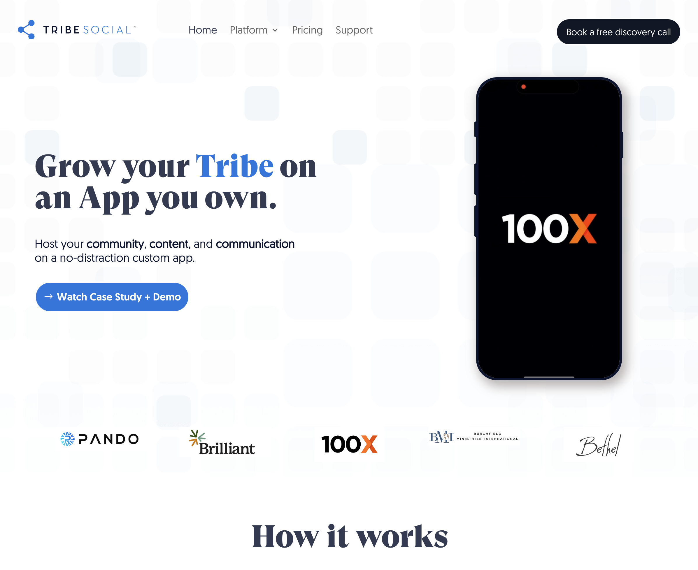
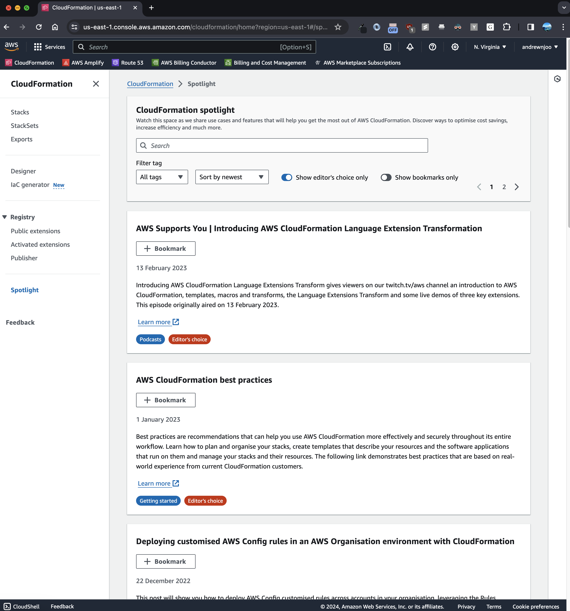
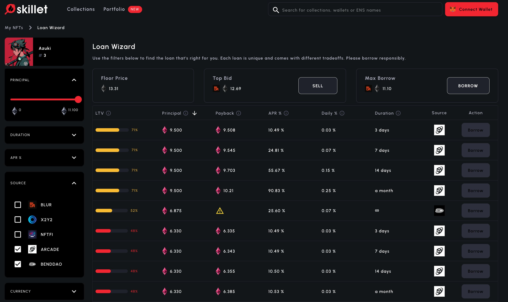

# brag-doc

if you make this public, double check that you are not leaking private information

info should be non material public information

document my work so I can improve and for historicity

2022 Inovo

🥞: Express, MySQL, React

2022 Amazon (AWS Cloudformation)

🥞: React, React Query, Java, Pipelines

2023 Skillet.ai (now Kettle.fi)

🥞: Next.js application, Express, Web3

2023 - 2024 Codeium

🥞: Next 13, Go

